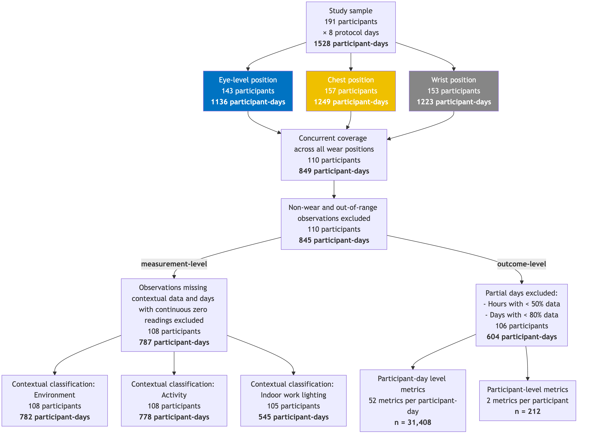
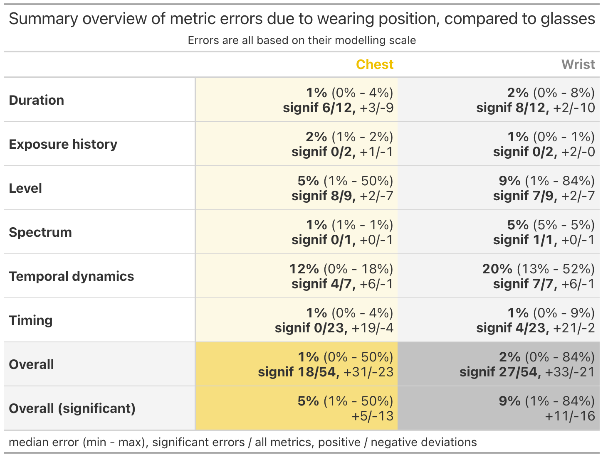

## Abstract

**Background:** Wearable light dosimeters enable personal exposure assessment under free-living conditions, but sensors are rarely positioned near the eyes - the relevant site for visual and non-visual responses. Chest- and wrist-worn sensors may improve participant compliance and study scalability, yet their placement-dependent measurement error and its consequences for derived exposure outcomes remain insufficiently characterised.

**Objective:** To quantify how chest and wrist placement affects time-resolved estimates of ocular light exposure across naturalistic contexts and to determine how these errors propagate into commonly used light-exposure metrics.

**Methods:** We analysed concurrent 10-s measurements from spectrally sensitive dosimeters worn near the corneal plane, on the chest, and on the wrist in a harmonised field study conducted across nine sites in seven countries. Melanopic equivalent daylight illuminance was compared at two analytical scales. Generalised additive mixed models quantified time-resolved placement error across environments, activities, photoperiods, times of day, and indoor light sources. Mixed-effects models compared 54 daily exposure metrics derived independently at each position, including duration-, exposure-history-, level-, spectrum-, temporal-dynamics-, and timing-based outcomes.

**Results:** Body-worn sensors generally underestimated eye-level exposure. Across categorical contexts, estimated mean errors ranged from −22.9% to −4.3% at the chest and from −54.6% to −30.3% at the wrist, with larger errors generally observed at night. Compared with eye-level metrics, 19 of 54 chest-derived outcomes and 27 of 54 wrist-derived outcomes differed significantly. Among significant contrasts, median absolute biases were 5% and 8%, respectively, but reached up to 50% at the chest and 84% at the wrist. Timing metrics were comparatively robust, whereas level and temporal-dynamics metrics were more placement-sensitive. Placement explained approximately 2% of outcome variance, compared with 26% attributable to participant-level differences.

**Significance:** Sensor-placement validity depends on analytical scale and exposure construct. Chest placement can support scalable studies focused on aggregated timing or duration outcomes, whereas wrist placement introduces greater and less predictable bias. Near-eye measurement remains preferable for time-resolved exposure levels and temporal-dynamics analyses.

## Introduction {#sec-intro}

Ocular light is a physical environmental exposure with effects extending beyond vision. Light reaching the eye regulates circadian entrainment, sleep–wake timing, acute alertness and other physiological and behavioural responses [@blume2019; @brown2020; @brown2022; @spitschan2026]. Emerging epidemiological evidence further associates patterns of daytime and nighttime light exposure with sleep, mental health, metabolic outcomes, and mortality [@didikoglu2023; @burns2023; @windred2024; @windred2024a; @zheng2026]. These findings have increased interest in personal light exposure as a potentially modifiable component of the human exposome [@spitschan2026]. However, evaluating its health relevance depends on accurately characterising the light that individuals receive as they move through natural and built environments.

Wearable dosimeters (light loggers) make it possible to capture this temporally dynamic exposure under free-living conditions [@vanduijnhoven2025]. Unlike stationary measurements or estimates based on outdoor conditions, wearable devices accompany participants across locations and activities and can therefore record exposure patterns arising from the interaction of environmental light, architecture and individual behaviour [@zauner2026b; @siraji2023; @spitschan2024; @zauner2026]. This advantage has supported increasingly large observational studies, as in the UK Biobank [@burns2023; @windred2024; @windred2024a; @zheng2026], and creates opportunities to integrate personal light exposure into environmental epidemiology. At the same time, wearable assessment introduces a fundamental measurement problem: the sensor is rarely positioned at the anatomical site corresponding to the exposure of interest, the eye.

For research on non-visual responses to light, the target quantity is generally the spectrally resolved optical radiation incident at the retina, which cannot be directly measured [@Spitschan2022V3]. Ideally, exposure is therefore measured close to the corneal plane, with a sensor orientation approximating the participant’s direction of view [@zauner2026c; @Spitschan2022V3; @zauner2026; @devries2025a]. Near-eye devices can, however, be conspicuous or uncomfortable and may interfere with everyday activities, limiting adherence and study duration [@zauner2025b]. Sensors placed on the chest or wrist impose less participant burden [@zauner2025b] and are consequently attractive for larger and longer studies [@zauner2026c]. The choice of wear position thus represents a trade-off between measurement fidelity and operational scalability. Whether that trade-off is acceptable depends not only on the average agreement between positions, but also on how placement-related differences vary across participants, environments and activities and how they affect the exposure summary metrics used in subsequent analyses.

The influence of anatomical placement has long been recognised in optical-radiation dosimetry. First in research on the effects of ultraviolet radiation (UVR) on humans, where studies quantified relative UVR doses across body surfaces using a mannequin [@diffey1977], characterised surface specific UVR doses for a variety of occupations and recreational activities [@holman1983], and assessed whether measurements of wrist-worn UVR dosimeters correlate with exposure measured on the top of the head [@thieden2000]. Comparable concerns subsequently emerged in personal visible-light dosimetry. Field studies in which participants wore sensors at multiple positions have compared measurements at the eye, chest and wrist [@Okudaira1983; @Cole1990; @Figueiro2013; @Bhandari2021; @aarts2017; @Wen2023; @gibaldi2024]. See @supptbl-wearing-position for a summary of results. The protocols of these studies are generally similar, differing mainly in the number of participants (one to twenty-nine), measurement duration (a few hours to several days), dosimeter type used, and the occupations and geographical locations of the participants. In addition to the raw recorded values (e.g., photopic illuminances), some studies examined errors in derived metrics such as circadian stimulus [@Figueiro2013], luminous exposure [@aarts2017], and time above threshold [@Bhandari2021; @Wen2023]. Collectively, these studies suggest that chest measurements generally approximate eye-level exposure more closely than wrist measurements, but they also report substantial variability and inconsistent directions of bias. Depending on the protocol and context, body-worn sensors have been found to either underestimate or overestimate measurements obtained near the eyes (see [@devries2026]).

Such inconsistencies are plausible because placement bias is generated by the spatial structure of the surrounding illumination environment and by the participant’s posture and orientation. A chest-mounted sensor may be shaded by clothing, directed away from a light source or exposed to light that does not reach the eyes. Wrist measurements are additionally affected by frequent changes in arm position and occlusion, e.g., from sleeves. Laboratory and simulation studies confirm that illuminance ratios between anatomical positions depend on factors such as source direction, light distribution, head and body orientation, and body morphology [@Yoshimura04052022; @Mohammadian2024; @devries2025; @devries2026; @devries2026a]. These studies establish the mechanisms through which placement affects measurement validity, but controlled illumination scenes cannot reproduce the diversity and temporal sequencing of environments encountered during daily life.

The practical consequences of placement bias also depend on the analytical scale and intended use of the exposure data. For time-resolved analyses, differences between simultaneous measurements indicate how closely a proxy sensor reproduces momentary eye-level exposure. Positive and negative deviations remain distinct at this scale and may reveal context-dependent measurement bias. Epidemiological and intervention studies, however, commonly reduce light time series to daily or phase-specific metrics, including mean exposure, cumulative exposure, time above a threshold, or the timing of exposure [@hartmeyer2022, @hartmeyer2023, @zauner2025]. When measurements are aggregated, overestimation during some periods can offset underestimation during others. Consequently, a body position may poorly reproduce individual measurements yet yield a comparatively similar daily summary, or, conversely, small systematic differences may accumulate into substantial differences in an exposure metric. Correlation between positions alone therefore cannot establish whether a proxy is fit for a particular scientific purpose. This distinction is especially relevant to environmental epidemiology because placement-dependent error may alter exposure ranking, attenuate associations, bias threshold-based classifications or affect estimates of compliance with exposure recommendations.

Here, we evaluate sensor-placement bias using data from the MeLiDos project, a harmonised field study of wearable light exposure conducted across sites in Ghana, Costa Rica, Türkiye, Spain, Germany, the Netherlands and Sweden [@spitschan2024; @guidolin2024; @zauner2026b]. Participants wore calibrated dosimeters near the corneal plane, on the chest, and at the wrist during their normal daily activities, accompanied by repeated contextual reports. We use near-corneal measurements as the reference estimate of ocular exposure and assess chest- and wrist-based proxies at two complementary levels. At the measurement level, we quantify time-resolved differences and examine how they vary with activity, primary light source, photoperiod, and indoor-outdoor context. At the outcome (metric) level, we determine how wear position affects 54 commonly used daily and phase-specific exposure summaries. By evaluating both instantaneous fidelity and outcome-level agreement under diverse free-living conditions, this study aims to establish when less burdensome sensor positions [@zauner2025b] provide fit-for-purpose estimates and when their use may introduce consequential exposure misclassification.

## Methods {#sec-methods}

### Dataset

Data were obtained from the field-study component of the MeLiDos project (Metrology for wearable light loggers and optical radiation dosimeters) [@spitschan2024]. The study used a harmonised protocol across nine study sites in seven countries: Ghana, Costa Rica, Türkiye, Spain, Germany, the Netherlands, and Sweden [@guidolin2024]. The complete MeLiDos field-study dataset comprises 191 participants and includes temporally resolved personal light-exposure measurements, participant wear and sleep logs, repeated contextual assessments, and questionnaire data [@zauner2026a]. The data are permissively licensed (CC-BY4.0). See [@zauner2026b] for details on device availability and measurement completeness differed between sites and participants.

For the present analysis, we used the personal light-exposure recordings from participants with concurrent near-corneal, chest-mounted, and wrist-worn measurements, together with the corresponding wear logs and hourly contextual reports. Near-corneal measurements were treated as the reference estimate of ocular light exposure, while chest- and wrist-based measurements were evaluated as alternative sensor positions. Contextual data included the participant’s reported activity and the primary light source in the surrounding environment. The specific inclusion criteria and processing steps used to construct the analytical dataset are described below.

Light exposure was recorded using spectrally sensitive ActLumus devices (Condor Instruments, São Paulo, Brazil) [@ishihara2025; @vanduijnhoven2025]. The devices sampled at 10-s intervals and used eight visible-range spectral channels to derive photopic and α-opic quantities, including melanopic equivalent daylight illuminance (m-EDI)[@cie0262018]. Participants wore separate devices mounted centrally on non-prescription spectacle frames near the corneal plane, as a pendant at chest level, and on the wrist. ActLumus devices have been independently evaluated against a criterion spectrometer under indoor electric-lighting and outdoor daylight conditions, showing a broad detection range, low inter-device variability, and comparatively high photopic accuracy [@ishihara2025]. Further details of the devices, calibration, wearing protocol, and field-study procedures are reported in the companion study [@zauner2026b].

*Figure on sensor placement, wearing position, color coding, and data types?*

### Software Resources

All data processing, statistical analyses, and visualisations were performed in R version 4.5.0 [@base]. Harmonised data from the individual MeLiDos study sites[@zauner2026a] were accessed using *melidosData* version 1.0.6 [@melidosData]. Personal light-exposure time series were processed, temporally aligned, annotated, and summarised using *LightLogR* version 0.10.0 [@zauner2025]. General data manipulation and visualisation were performed with packages from the *tidyverse* version 2.0.0 [@tidyverse].

Generalized additive mixed models were fitted using *mgcv* version 1.9-4 [@mgcv], and model-derived smooths, differences, and predictions were processed using *gratia* version 0.11.2 [@gratia]. Linear and generalized linear mixed-effects models were fitted using *lme4* version 2.0-1 [@lme4] and *glmmTMB* version 1.1.14 [@glmmTMB], where applicable. Estimated marginal means and contrasts were calculated using *emmeans* version 2.0.3 [@emmeans], and model diagnostics and variance-explanation statistics were obtained using *performance* version 0.16.0 [@performance].

All analyses were conducted using scripted workflows to support reproducibility. The analysis code, computational environment, and package-version information are available alongside the manuscript in a version-controlled repository <https://github.com/tscnlab/WearingPositionError_2026> and an archived release (to be added and referenced).

### Preprocessing and cleaning of data

The site-specific wearable datasets provided by melidosData [@melidosData] had already undergone several harmonisation steps before entering the present analysis. Raw dosimeter files were imported, and each participant's time series was trimmed to the official trial dates recorded in the study metadata. Implausible values attributable to device malfunction were identified and removed on a per-participant basis. Irregular sampling intervals and implicit gaps were then resolved by regularising every time series to a uniform 10-second epoch: when more than one measurement fell within a 10-second window the values were averaged, whereas a single measurement was assigned to the nearest 10-second boundary. The result was a continuous, gap-free time series for each participant and wearing position. [@melidosData]

The target metric, and basis for summary metrics, is melanopic equivalent daylight illuminance (m-EDI), as defined by the CIE standard S026 [@cies026]. m-EDI are derived from the spectral sensors of the wearable devices through device-internal computation.

Because the measurement-level and outcome-level analyses place different demands on the data, two separate preprocessing pipelines were applied downstream (@fig-met-flowchart). The measurement-level analysis requires strict temporal alignment of concurrent observations but can tolerate incomplete days, whereas for the outcome-level analysis daily and multi-day summary statistics are computed and therefore sufficiently complete days are required. The specific filtering steps for each pipeline are described in the respective subsections below.

Both analyses require log-transformation of light-exposure values. Because light-exposure data frequently contain zero values --- for example, during complete darkness --- a standard logarithmic transformation is undefined at zero. To address this, a zero-inflated log~10~ transformation [@zauner2025a] was applied using the *log_zero_inflated* function of the *LightLogR* package:

$$x' = \log_{10}(x + c)$$ {#eq-logzeroinflated}

where $c = 0.1$ lx m-EDI is a small offset added prior to transformation. This maps a value of 0 lx to $x'=-1$ on the transformed scale while preserving the interpretability of the log~10~ scale for positive values. The offset lies below the operating range of the dosimeters and therefore has no meaningful impact on the results. The transformation is invertible via $x = 10^{x'} - c$, so that model estimates can be back-transformed to the original measurement scale. The specific metrics and model responses to which this transformation was applied are listed in @supptbl-metric-list.

{#fig-met-flowchart}

#### Measurement-level analysis

m-EDI measurements from the three dosimeters were temporally aligned. The resulting combined dataset was then processed through several filtering steps. First, only timesteps with data from all three dosimeters were retained. Second, based on the participants' logbooks, observations during sleep and other periods when one (or more) of the dosimeters was not worn, were removed. Third, only observations for which all dosimeters recorded a measurement below their maximum operating range (\<100,000 lx m-EDI, as specified by the manufacturer) were retained. Fourth, days on which all three dosimeters recorded continuous zero values were removed. Finally, each observation was paired with (hourly) data derived from the contextual reports, specifically the activity performed and the primary light source in the environment. The different activities and light source categories that participants could choose from are detailed in the study protocol [@guidolin2024]. When these data were not reported, the corresponding observations were removed. Additionally, the photoperiod state (i.e., day or night based on civil dawn and dusk) was matched to each observation. The resulting number of observations in terms of unique participants and measurement days after each processing step is shown in @fig-met-flowchart.

The resulting measurements were log-transformed using the zero-inflated log~10~ transformation (@eq-logzeroinflated). For each observation, the wear position error was calculated as the difference between each body-worn dosimeter's measurement and the eye-level reference. These observation-level errors were then aggregated to an hourly resolution to align with the temporal resolution of the contextual data. This pairwise-difference approach preserves the wear position error, whereas averaging before computing the error would attenuate the error estimates. Accordingly, the (hourly aggregated) wear position error $\bar{D}_x$ is defined as shown in @eq-hourlyerror

$$\bar{D}_x = \frac{1}{n}\sum_{i=1}^{n}\left[\log_{10}(E_{x,i} + 0.1) - \log_{10}(E_{glasses,i} + 0.1)\right]$$ {#eq-hourlyerror}

where $E_{glasses,i}$ denotes the eye-level measurement and $E_{x,i}$ denotes the measurement at wear position $x$, both recorded at timestamp $i$, and $n$ is the number of measurements within the hour. A positive wear position error indicates that the body-worn dosimeter overestimates actual eye-level light exposure.

#### Outcome-level analysis

m-EDI and photopic illuminance recordings from the glasses, chest, and wrist positions were prepared as described in the previous section, yielding a single time series with concurrent measurements from all three positions at each time point. Two deviations from the procedure were required. First, no filtering by missing activity or primary light source log entries was performed. Second, sleep time measurements were retained, as some daily metrics require complete datasets. To ensure that the daily metrics were computed from sufficiently complete data, two further completeness filters were applied. Hours in which more than 50% of the expected 10-second observations were missing were discarded. After this hourly filter, days retaining less than 80% of their expected hourly bins were removed entirely.

From the cleaned dataset, a comprehensive set of daily light-exposure metrics was computed per participant, day, and wearing position using *LightLogR* metric functions. These included duration above threshold (at 10, 250, and 1,000 lx m-EDI), mean period above threshold, pulse analysis, brightest and darkest 10-hour period characteristics, timing of first and last threshold crossing, frequency of threshold crossings, the Barroso lighting metrics, centroid of light exposure, disparity index, midpoint of cumulative exposure, mean log-transformed m-EDI, luminous dose, the melanopic daylight equivalent ratio (MDER), and the non-visual relative dose (nvRD). Interdaily stability and intradaily variability, which require data spanning multiple days, were computed per participant and wearing position across all available days. For definitions of all metrics see [@hartmeyer2023].

Finally, two nighttime timing metrics, the darkest 10-hour midpoint and the darkest 10-hour onset, were rescaled to avoid circularity around midnight. Values falling after 12:00 (noon) were shifted by subtracting 24 hours, so that times in the late evening are represented as negative values relative to midnight. This ensures that these metrics can be modelled with standard linear methods without artefacts from the midnight boundary.

### Statistical analysis

No a priori power analysis was performed, as the sample size was determined by the available dataset [@zauner2026a] rather than by a prospective study design. The analyses were primarily estimation-focused. Effect estimates and their confidence intervals were used to characterise the magnitude, direction, and consistency of placement-dependent differences across contexts and exposure metrics. Inferential tests were treated as descriptive or exploratory aids rather than as independent confirmatory hypothesis tests. Thus, no adjustment for multiple comparisons was applied; consequently, individual p-values should not be interpreted in isolation, and conclusions were based principally on effect sizes, uncertainty intervals, and patterns across related outcomes.

#### Measurement-level analysis

Previous studies have shown that wear position errors are influenced by both the illumination environment surrounding the participant and the participant’s posture during the measurements [@Yoshimura04052022; @Mohammadian2024; @devries2026; @devries2026a]. As these characteristics were not directly quantified, four sets of contextual classifications (@supptbl-context-class) were defined from the available contextual data to serve as proxies for grouping illumination fields and postures. The first set combined the environment, (whether the participant was indoors, i.e., in a building or outdoors) with the photoperiod (day or night). The second set combined the environment with the local time of day. The third set combined activity with photoperiod. Activity categories included being awake at home, working (at home or in an office), travelling in a vehicle, and time outdoors. This last category grouped walking or cycling, outdoor work, and outdoor leisure, as each was too sparsely reported to be examined separately. The fourth set considered the primary light source in the environment during indoor work at home or in an office. The number of participants and participant-days included for each set is shown in @fig-met-flowchart.

Generalised additive mixed models (GAMMs)[@hastie1986; @hastie1995; @pedersen2019] were fitted to model wear position error as a function of these four sets of contextual classifications. To avoid multicollinearity and facilitate interpretation, separate models were constructed for each set. In addition, separate models were fitted for each wear position (chest and wrist), resulting in a total of eight models. The contextual classifications were defined as fixed effects, except for local time of day, which was defined as a cyclic smooth. As the distribution of wear position errors was observed to have heavy tails, a scaled t-distribution was specified for residuals. Random effects (random intercepts) were specified for site, participant (nested within site), and day (nested within participant). This structure reflects the study protocol [@guidolin2024], under which measurements were collected across multiple days for each participant at a site. Although some of these random effects explained little variance in certain models, all were retained as their inclusion is theoretically justified by the study protocol. Additionally, for each participant, a first order autoregressive error structure ($AR(1)$) was implemented to account for temporal autocorrelation in repeated measurements. The $AR(1)$ correlation parameter (*rho*) was set to the lag-1 residual autocorrelation estimated from an initial model fitted without the $AR(1)$ structure. The resulting model formulas are given in @supptbl-formulas-context.

Given the size of the dataset (approximately 10,000 observations), models were fitted using the *bam()* function (*mgcv* package) with fast restricted maximum likelihood (fREML) and discretisation enabled. Fixed-effect estimates agreed to three decimal places (maximum absolute difference \< 0.001 log~10~ units) with those from the *gam()* function with REML and without discretisation (both fitted without the AR(1) structure), indicating no meaningful impact on model estimates.

All models converged. As wear position errors represent differences between paired dosimeter measurements and the contextual classifications represent relatively coarse descriptions of the measurement context, the proportion of deviance explained by the models was modest, ranging from 11.3% to 32.9%. As the models were intended to identify systematic differences in wear position error across contexts rather than to predict individual errors, these levels were considered acceptable. The degrees-of-freedom parameter (ν) of the scaled-t residual distribution, however, was estimated at its lower bound (3) in all models, suggesting that the true residual distribution may be heavier-tailed than the models can represent. Consistent with this, the residual distributions showed fair agreement in the central portion but slight deviations in the tails (model diagnostics are available in the \[supplementary material\]). Since there was no residual family available within *mgcv* that could accommodate heavier tails, and additional transformations of the data were not appropriate given the log transform already applied, no further optimisation of the model fit was deemed feasible. Given these limitations, model interpretation is based primarily on estimated mean effects across contexts.

Using the fitted models, two complementary analyses were performed. First, we assessed whether wear position errors differed across the contextual classifications. For each pairwise comparison of contexts, the null hypothesis stated that the difference in wear position error is zero. Estimated marginal means of the wear position error under each context were computed with the *emmeans* package, and contexts were pairwise compared using model-based t-tests (using the *contrast()* function of *emmeans*). The contextual classifications that included the time of day smooth (@supptbl-context-class) were excluded from this analysis to limit the number of comparisons. Second, we assessed the mean wear position error for each contextual classification, with the null hypothesis stating that under each context, the mean wear position error equals zero (i.e., no systematic difference between body-worn and eye-level measurements). Each estimated marginal mean was tested against zero using model-based t-tests (with the *test()* function of *emmeans*). For interpretability, the estimates (on the log~10~ scale) were back-transformed to percentage errors. In both analyses a significance level of 0.05 was used.

#### Outcome-level analysis

To quantify how wearing position affects daily summary metrics, each of the 54 metrics was modelled separately using linear or generalised linear mixed-effects models. The choice of model engine and distributional family was determined by the distribution of each metric's response variable [@zauner2026b]. Most metrics (46 of 54) were modelled with linear mixed-effects models (Gaussian family). Duration metrics whose distributions were continuous but right-skewed and zero-inflated (e.g., total duration above threshold) were modelled with generalised linear mixed-effects models using a Tweedie distribution[@gilchrist2000] with a log link (5 metrics). Count metrics (number of pulses above threshold, frequency of threshold crossings; 3 metrics) were modelled using a Poisson family. Several metrics required response transformations prior to modelling: metrics that had been pre-transformed with a zero-inflated log~10~ transformation during preparation were modelled on that scale [@zauner2025a], interdaily stability was logit-transformed to respect its \[0, 1\] bounded range, and pulse-level metrics (mean level and mean duration of pulses) were modelled on the zero-inflated log~10~ scale [@zauner2025a]. The full specification of response transformations, engines, and families for each metric is provided in @supptbl-metric-list.

All models shared the same fixed- and random-effects structure, expressed in Wilkinson notation as:

$$\text{metric} \sim \text{site} * \text{position} + (\text{position}|\text{participant}) + (1|\text{date})$$ {#eq-metricbase}

Here, the fixed effects consist of the measurement *site* (the geographical location of data collection), the wearing *position*, and their interaction. The interaction term allows the position effect to vary across sites. The random-effects structure includes random intercepts and random slopes for wearing *position* per *participant*, which accounts for between-participant variability in the magnitude of position effects, as well as random intercepts per calendar *date* (participant-day) to capture day-to-day variability. The glasses position was set as the reference level for position, so that the model estimates for chest and wrist represent deviations from eye-level measurements. Site was sum-coded (deviation coding), so that the intercept represents the grand mean across all sites rather than a single reference site.

When models failed to converge or produced singular fits with the full random-effects structure, complexity was reduced in a stepwise procedure. First, the random intercept for date was removed. If convergence was still not achieved, the random slope for position was simplified to a random intercept only. All 54 models converged and were non-singular after this procedure. Model diagnostics were assessed using the *performance* R package and included checks for normality of residuals and random effects, homogeneity of variance, linearity, and collinearity.

The significance of fixed effects was assessed using Wald $\chi^2$ tests via the *Anova* function from the *car* R package, with a significance level of $\alpha$ = 0.05. To express position effects as interpretable relative differences independent of scale, model estimates were calculated relative to the baseline using @eq-trans:

$$\text{relative effect} = (\frac{\text{effect}} {|\text{Intercept}|} -1) \times 100\%$$ {#eq-trans}

where the intercept is the estimated marginal mean for the glasses position averaged across all sites, and the effect is the estimated difference between a body-worn position (chest or wrist) and glasses.

Marginal and conditional $R^2$ values were calculated following the method described by Nakagawa and colleagues @nakagawa2017. To decompose the variance explained by individual model components, partial $R^2$ contributions were computed as the difference in $R^2$ between the full model and a reduced model from which the component of interest had been removed. This decomposition was performed for the position fixed effect, the site fixed effect, the random slope of position across participants, the random effect of date, and the random participant intercept.

## Results {#sec-results}

#### Measurement-level analysis

Estimated wear position errors for each contextual classification are shown in @fig-abs-context. Errors were consistently larger in magnitude for wrist-worn dosimeters than for chest-worn dosimeters, and were generally larger at night than during the day. Across all categorical contextual classifications (environment, activity, and indoor work lighting source) and for nearly all hours of the day, mean errors were negative, indicating that body-worn dosimeters underestimated eye-level light exposure. Almost all errors differed significantly from zero, the only exceptions were chest-worn measurements taken in vehicles during the day (@fig-abs-context, Panel A) and outdoor measurements during the night and morning hours (@fig-abs-context, Panel B, approximately 02:00-12:00 local time).

{#fig-abs-context}

The estimated differences in wear position errors between contextual classifications are shown in @fig-ratio-context. In each cell, the ratio is the wear position error in the second context relative to the first context, indicating how many times larger or smaller the error is between contexts. Significant differences in wear position errors are shown in bold. Considering chest-worn dosimeters, six of the seventeen investigated comparisons were significant, whereas seven of the seventeen comparisons were significant for wrist-worn dosimeters. Among the contextual classifications evaluated separately by photoperiod (@supptbl-context-class), all significant differences for chest-worn dosimeters were observed during daytime, whereas significant differences for wrist-worn dosimeters occurred during both daytime and nighttime. For classifications based on the primary light source in indoor work environments, significant differences in wear position error were observed between electric and display lighting, for both chest- and wrist-worn dosimeters.

{#fig-ratio-context width="80%"}

#### Outcome-level analysis

The effects of wearing position on the 54 light-exposure metrics are summarized in @tbl-metric-summary and reported in full in @supptbl-metric-bias. Compared with the eye-level reference, 19 metrics reached nominal statistical significance for the chest position (35%) and 27 differed significantly for the wrist position (50%). Across metrics, the wearing-position fixed effect accounted for approximately 2% of the variance, whereas participant-level differences accounted for approximately 26%. Among metrics with a significant position effect, the median absolute bias was 5% for chest-derived metrics and 8% for wrist-derived metrics. For comparison, the median participant-level standard deviation was approximately 9%. Both body-worn positions predominantly underestimated the corresponding eye-level metric: the estimated bias was negative for 13 of the 19 significant chest contrasts and 16 of the 27 significant wrist contrasts.

{#tbl-metric-summary}

The magnitude of bias varied across metric categories. Among the 12 duration-based metrics, the median absolute bias was 1% for the chest position, with six significant contrasts, and 2% for the wrist position, with eight significant contrasts. Neither of the two exposure-history metrics differed significantly from its eye-level counterpart at either body position. The nine level-based metrics showed more pronounced biases: the median absolute bias was 5% for the chest position, with eight significant contrasts, and 9% for the wrist position, with seven significant contrasts. The single spectrum-based metric did not differ significantly at the chest position but showed a significant 5% bias at the wrist position. The largest median biases were observed for the seven temporal-dynamics metrics: 12% for the chest position, with five significant contrasts, and 15% for the wrist position, with all seven contrasts significant. In contrast, the 23 timing-based metrics were comparatively robust to wearing position. None differed significantly at the chest position, whereas four differed significantly at the wrist position, for which the median absolute bias was 1%.

Duration and level-based metrics showed a general tendency towards underestimation, with the majority of contrasts indicating negative biases. This pattern suggests that body-worn positions consistently underestimated eye-level measurements across these metric categories. Temporal-dynamics-based metrics showed a tendency for overestimation, with the majority of contrasts indicating positive biases.

Among metrics showing significant position effects, absolute biases ranged from 1% to 50% for the chest position and from 1% to 84% for the wrist position. Both maxima arose for the *Dark threshold* of the *Barroso metrics* @hartmeyer2023. The distributions of signed and absolute biases for significant and non-significant contrasts are shown in @fig-metric-dist.

{#fig-metric-dist}

Site-by-position interactions were detected for 12 of the 54 metrics, indicating that the magnitude of wearing-position bias was not fully consistent across measurement sites (@supptbl-metric-bias). Out of 54 metrics assessed for 8 sites (432 combinations), site-specific biases were greater than the across-site average in 14 instances for the chest. Biases were smaller than the across-site average in 11 instances. For the wrist position, site-specific biases were greater than the across-site average in 16 instances. Biases were smaller than the across-site average in a further 10 instances. In total, site effects mediated the position effect in 51 of 432 cases (\~12%).

The random-effects structure including a random effect of date could be estimated for 11 of the 54 metrics. For these 11 metrics, day-to-day variability was substantial, with date-level standard deviations ranging from 5% to 65%. Correspondingly, the partial variance contribution of date was consistently greater than that of the fixed wearing-position effect: partial $R^2$ values ranged from 13% to 27% for date, compared with 0% to 5% for wearing position.

The random-effects structure including participant-specific random slopes for wearing position could be estimated for 12 out of 54 metrics. Participant-specific variation in the position effect was considerable, but smaller compared to the date effect. The standard deviation of the participant-specific random slopes ranged from approximately 1% to 59% for the chest position and from 1% to 80% for the wrist position. In all but one of the models for which these random slopes could be estimated, their standard deviation exceeded the corresponding population-average position bias. Thus, although the average bias associated with wearing position was generally modest, its magnitude varied substantially among participants and is expected to switch sign (e.g., from under- to overestimation) with some regularity. Assuming that the standard deviation of the random slope is equal to the fixed effect wearing position bias, and disregarding random intercepts, about 16% of participants are expected to have a bias in the other direction to the average. This heterogeneity indicates that population-average correction factors would not necessarily provide accurate corrections for individual participants.

As an exploratory sensitivity analysis, the preprocessing pipeline was repeated without excluding documented non-wear periods. This analysis provides a tentative indication of the extent to which the treatment of non-wear affected the estimates. The results were broadly consistent with those of the primary analysis (@supptbl-metric-nonwear; @tbl-metric-summary). However, estimated wearing-position biases were generally smaller when documented non-wear periods were retained. This attenuation should not be interpreted as improved agreement with the eye-level reference, because retaining these periods introduces an additional source of measurement bias arising from device non-wear.

## Discussion {#sec-disc}

### Summarizing results

This study examined sensor-placement bias at two complementary analytical scales. The measurement-level analysis quantified differences between simultaneous body-worn and eye-level measurements before temporal aggregation. It therefore captures the extent to which a body-worn sensor reproduces momentary eye-level exposure. By contrast, the outcome-level analysis compared daily summary metrics derived separately at each position. This approach evaluates the consequences of sensor placement for the exposure variables likely to be used in epidemiological or intervention studies, but allows overestimation during some periods to offset underestimation during others. Accordingly, the two analyses address distinct questions: the measurement-level analysis characterises time-resolved proxy error, whereas the outcome-level analysis characterises the resulting bias in derived exposure outcomes.

Across all categorical contextual classifications and for nearly all hours of the day, estimated mean wear position errors were negative and almost all differed significantly from zero (@fig-abs-context), indicating that body-worn dosimeters underestimate eye-level light exposure. The only exceptions were chest-worn measurements taken in vehicles during the day and outdoor measurements during the late night and morning hours (approximately 02:00-12:00 local time). Wear position errors were consistently larger in magnitude for wrist-worn than for chest-worn dosimeters. For the categorical contextual classifications, estimated mean errors ranged from -22.9% to -4.3% for the chest and from -54.6% to -30.3% for the wrist (@fig-abs-context). Wear position errors as a function of time of day were in a similar range, but more closely approaching zero (-23.6% to 0.1% for the chest and -49.8% to -22.0% for the wrist). These minor differences in ranges may reflect that the categorical contextual classifications were designed to distinguish between different illumination fields and body postures (which may impact the magnitude of wear position errors [@Yoshimura04052022; @Mohammadian2024; @devries2026; @devries2026a]), while errors based on time of day cut across these classifications, as participants may be in different environments and engaged in different activities at the same hour (although certain hours may be dominated by a common activity). Consequently, wear position errors by time of day represent averages of the errors across the various contexts that occur at that time.

The magnitude of wear position errors varied with measurement context, though the variation between contexts was limited in absolute terms. All estimated mean wear position errors based on categorical contextual classifications spanned just 18.6% for the chest and 24.3% for the wrist. This modest range is consistent with the results of the pairwise comparisons of wear position errors between contexts (@fig-ratio-context), where fewer than half of the comparisons were significant, as well as with the results for wear position errors based on time of day (@fig-abs-context), where overlap is visible in the confidence intervals of indoor and outdoor errors. However, for the chest, estimated mean wear position errors reached as low as -4.3% in some contexts, so context could determine whether the error was minor or approached roughly -20%. For the wrist, estimated mean errors were at least -30.3% for every categorical contextual classification, so while context still shifted the error, the underestimation was already substantial regardless of context.

For chest- and wrist-worn dosimeters, estimated mean wear position errors were consistently larger at night than during the day. A plausible explanation is that in the absence of daylighting, illumination primarily comes from electric sources that are typically more directional and unevenly distributed than daylight, resulting in spatially heterogeneous illumination fields, which have been associated with larger wear position errors [@devries2026; @devries2026a]. Similarly, among the primary light sources in indoor work environments, the largest errors were present under display lighting. As displays are fairly directional light sources, they are expected to produce more heterogeneous illumination fields than electric lighting or daylighting.

For contexts classified by environment and activity, no consistent pattern in wear position error was observed across both wear positions. For chest-worn dosimeters, the estimated mean wear position errors for indoor and outdoor conditions differed significantly (pairwise comparisons, @fig-ratio-context) during the day (-16.4% indoors, -7.3% outdoors) but not at night (-19.6% indoors, -16.4% outdoors). In contrast, for wrist-worn dosimeters the opposite pattern was observed: no significant difference in estimated mean wear position error was present during the day (-33.8% indoors, -33.4% outdoors), whereas a significant difference was present at night (-40.0% indoors, -47.2% outdoors). Considering the contextual classifications based on activity, wear position errors broadly followed the environmental (indoors or outdoors) pattern, with indoor activities (awake at home, working in the office/home) resembling the indoor error and outdoor activities (in a vehicle and time outdoors) resembling the outdoor error.

The outcome-level analysis showed that the substantial time-resolved errors observed in the measurement-level analysis did not translate uniformly into equally large biases in daily exposure metrics. Across all 54 metrics, 19 chest-level contrasts and 27 wrist-level contrasts differed significantly from the eye-level reference. Among the significant contrasts, the median absolute bias was 5% at the chest and 8% at the wrist, although individual estimates ranged from 1% to 50% and from 1% to 84%, respectively. Body-worn measurements therefore produced systematic differences in a considerable proportion of derived outcomes, particularly at the wrist, but the magnitude of bias depended strongly on the metric being calculated.

Timing-based metrics were comparatively robust to sensor placement. None of the 23 timing metrics differed significantly at the chest, and only four differed at the wrist, where the median absolute bias was 1%. Exposure-history metrics were similarly unaffected. By contrast, level-based and temporal-dynamics metrics were more sensitive. The median absolute bias for level-based metrics was 5% at the chest and 9% at the wrist, while temporal-dynamics metrics showed median biases of 12% and 15%, respectively. All seven temporal-dynamics metrics differed significantly at the wrist. Duration-based metrics occupied an intermediate position, with generally small median biases but significant effects for half of the chest contrasts and two-thirds of the wrist contrasts. These findings demonstrate that sensor-placement validity cannot be expressed by a single correction factor or overall measure of agreement; it depends materially on the exposure construct.

The contrast between the two analytical scales is informative. Momentary body-worn measurements predominantly underestimated eye-level exposure, often by approximately 5–25% at the chest and 30–55% at the wrist. Daily metric biases were generally smaller because deviations occurring at different times could partially cancel during aggregation. Timing of exposure was largely unaffected on a systematic level, which depend more on when exposure occurs than on its exact level. In contrast, level and temporal-dynamics metrics remain sensitive to systematic attenuation and to changes in the amplitude or variability of the exposure time series. A body-worn sensor may therefore be unsuitable for reproducing individual eye-level measurements while still providing a reasonably similar estimate of some daily outcomes. Conversely, acceptable agreement for one metric should not be interpreted as evidence that the underlying time series is identical.

Duration- and level-based metrics predominantly showed negative biases, consistent with the systematic underestimation identified in the measurement-level analysis. Temporal-dynamics metrics more frequently showed positive biases, indicating that attenuation of exposure levels does not necessarily translate into attenuation of all derived outcomes. Changes in the relative amplitude, fragmentation or frequency structure of the recorded series can increase some measures of temporal variability even when the measured exposure level is lower overall. This further cautions against interpreting placement bias solely as a multiplicative reduction in exposure.

Position effects also varied across sites, days and participants. Site modified the estimated position effect in approximately 12% of the evaluated site–metric combinations. For the subset of models in which date-level random effects could be estimated, day-to-day variability explained more variance than wearing position. Participant-specific position effects were likewise substantial and generally exceeded the corresponding population-average bias. Consequently, two participants wearing the same sensor at the same anatomical position may experience biases of markedly different magnitude and, in some cases, opposite direction. Population-average correction factors may reduce mean bias at the group level but cannot be expected to recover eye-level exposure accurately for individual participants.

### Comparison with literature

Our results can be compared with previous studies that assessed wear position errors using similar methodologies, i.e., placing a dosimeter near the eyes and on the body, and comparing the body-worn measurements relative to the eye-level reference to quantify the error. We first compare our overall wear position errors against such studies, discussing the wrist and chest in turn, and then consider the error as a function of measurement context.

For the wrist position, we found significant negative errors, indicating that wrist-worn dosimeters underestimate actual eye-level light exposure. This finding is supported by two prior studies. Figueiro et al. [@Figueiro2013], drawing on measurements from twelve older adults over five days each, found large absolute differences (photopic lux) between measurements at the eyes and wrist, resulting in a significant negative wear position error for most hours of the day. Similarly, Bhandari et al. [@Bhandari2021] found that measurements at the wrist of twenty-five young adults, each recorded over at least four days, were systematically lower than at the eyes (mean difference of 126 lx). However, a third study disagrees with our results. Based on measurements from twenty-nine hospital workers over a single day each, Wen et al. [@Wen2023] reported that measurements at the eyes were significantly lower than those at the wrist, indicating a positive wear position error.

For the chest position, our results are less consistent with those reported in these studies. We found mostly negative wear position errors of chest-worn dosimeters, though not all were significant. In contrast, Figueiro et al. [@Figueiro2013] reported similar measurements at the eyes and chest (dosimeter worn as a pendant), with no significant differences for any hour of the day. They did note limited daytime fluctuations in these differences, which we also observed in our model of wear position error as a function of time of day. The results of Wen et al. [@Wen2023] again disagree, as they also reported that measurements at the eyes were significantly lower than those at the chest. Additionally, they found no significant differences between measurements taken at the chest and wrist. We did not test that comparison directly, so we cannot evaluate it statistically; our estimates do, however, indicate substantially larger errors at the wrist than at the chest. No comparison is made with the results of Bhandari et al. [@Bhandari2021] because they did not consider the chest position.

Our results indicate that the measurement context modulates the wear position error. Studies confined to a single location with few participants may therefore reach different conclusions from ours, which drew on 108 participants across eight geographic locations. This point is illustrated by Wen et al. [@Wen2023]: their sample consisted only of workers at one hospital, and they speculate that the positive wear position error in their data may stem from the participants' downward gaze while working, a posture specific to that setting. A further source of divergence may be instrumentation, as these studies used different types of dosimeters at the eyes and the body, which may have introduced error.

Two prior studies quantified wear position errors as a function of measurement context, allowing a more direct comparison with our results. Aarts et al. [@aarts2017] quantified wear position errors for chest- and wrist-worn dosimeters under indoor and outdoor daytime conditions, though based on a single participant with less than two hours of measurements. In terms of luminous exposure, they reported that chest-worn dosimeters underestimated by 2% indoors and overestimated by 9% outdoors, while wrist-worn dosimeters overestimated by 17% indoors and underestimated by 11% outdoors. These errors are generally smaller in magnitude than ours, and in two conditions they are of opposite sign, since we observed only underestimation under these conditions. Given that their estimates were derived from a single participant, they are likely highly specific to that participant's posture and the illumination fields they experienced.

More recently, de Vries et al. [@devries2026; @devries2026a] quantified wear position errors of chest-worn dosimeters under simulated indoor work lighting scenarios. Because their study was simulation-based, they reported a range of errors depending on the specific illumination field and posture of the participant. Under idealised overhead electric lighting, chest-worn dosimeters overestimated eye-level measurements (positive wear position error), whereas underestimation occurred under vertically oriented light sources such as windows or displays (negative wear position error). Their results for vertically oriented sources (Figure 3 in [@devries2026a]) broadly agree with ours for daylight and display lighting (@fig-abs-context). However, whereas most of their simulations indicated overestimation under solely ceiling-based lighting, we observed underestimation by chest-worn dosimeters when electric light was the primary source, though smaller in magnitude than under daylight or display lighting. This likely reflects that real-world electric lighting is not strictly ceiling-based, and that our primary light source classification is only an indication, as secondary sources may have also been present.

A modest systematic underestimation by body-worn sensors is not necessarily undesirable in itself. Measurements of illuminance or melanopic EDI obtained at the corneal plane can overestimate the effective light input to the eye because conventional planar measurements do not account for the restricted and directionally non-uniform human field of view [@cies026; @zauner2023]. In principle, a small negative placement bias could therefore partially offset this geometric overestimation. However, the present results do not support treating chest- or wrist-level underestimation as a reliable compensatory correction. The magnitude of the bias varied substantially between participants, metrics, contexts, and days, and individual effects could differ in both size and direction from the population average. Any apparent compensation would therefore be incidental rather than systematic, and applying a population-level correction could reduce error for some individuals while increasing it for others.

Direct comparison of our outcome-level findings with the existing literature is limited because previous studies evaluated different optical quantities, summary metrics, thresholds, time periods, and sensor systems (@supptbl-wearing-position). Nevertheless, the available studies support the conclusion that aggregation into daily metrics can reduce, but does not eliminate, placement-dependent differences. Bhandari et al. [@Bhandari2021] reported wrist values approximately 37–38% lower than temple-level measurements for mean daily illuminance, but only about 22% lower for time above 1,000 lx. This contrast is consistent with our finding that level-based metrics were generally more placement-sensitive than duration- or timing-based outcomes. Similarly, Cole et al. [@Cole1990] observed almost identical 24-hour mean illuminance at the forehead and wrist despite identifiable discrepancies in the underlying time series, illustrating how positive and negative deviations may cancel during daily aggregation. In contrast, Wen et al. [@Wen2023] found both mean illuminance and the proportion of time above 1,000 lx to be approximately twice as high at the chest and wrist as at eye level, demonstrating that aggregation does not ensure small bias when positional differences are systematic within the monitored setting. Figueiro et al. [@Figueiro2013] likewise reported substantial position dependence in absolute photopic and circadian exposure despite greater similarity in broad temporal patterns. Taken together, these studies broadly agree with our observation that the validity of a body-worn proxy is metric-specific: outcomes determined mainly by exposure level or amplitude are generally more vulnerable to placement bias, whereas some timing and duration measures may remain comparatively stable. However, the direction and magnitude of published effects vary considerably, and several studies confounded position with sensor type or were restricted to a single setting or participant. Our results extend this literature by comparing identical simultaneous devices across a larger, geographically diverse sample and by showing systematically, across 54 metrics, that agreement for one exposure summary cannot be generalised to other metrics derived from the same time series.

### Limitations

Several limitations relate to the study population, protocol and interpretation of the eye-level reference. Participants were predominantly healthy adults whose daily routines commonly involved indoor work. Placement effects may differ in children, older adults, clinical populations, outdoor workers or groups with systematically different postures, mobility patterns, clothing or occupational environments. Sample sizes also varied between sites and were comparatively small at UCR and TUM, with six and ten participants, respectively. Although the multisite design increased the diversity of environments represented, estimates of site-specific deviations are therefore less precise for these locations.

The spectacle-mounted sensor provided a practical near-eye reference but did not measure corneal or retinal exposure directly. Its position, orientation and field of view differ from those of the eye, and it cannot account for eye rotations, eyelid closure, pupil size or spectral transmission through the ocular media. The reference should therefore be interpreted as an approximation of light incident near the corneal plane rather than as a direct measurement of retinal irradiance. Nevertheless, because the spectacle-mounted, chest and wrist sensors were of the same type and recorded simultaneously, the comparisons isolate anatomical placement more directly than studies in which device type and wearing position are confounded.

Non-wear periods were identified from participant records and could therefore be removed only when they were documented. Undocumented removal, displacement or occlusion of a device may remain in the dataset and could contribute to both measurement-level and outcome-level differences. The sensitivity analysis retaining documented non-wear periods produced generally smaller position biases, illustrating that apparent agreement can improve when a separate source of exposure misclassification is introduced. This attenuation should not be interpreted as evidence that retaining non-wear periods improves measurement validity.

For the calculation of daily metrics, recorded sleep periods were retained even though the spectacle-mounted and chest-worn sensors were not worn during sleep. Participants were instructed to place these devices face-up on a bedside surface, such that they measured ambient light within the sleep environment rather than light incident at their habitual wearing positions. The wrist sensor may also have been covered by bedding or clothing. Metrics incorporating the sleep interval therefore represent differences between position-specific measurements during wakefulness and differently situated environmental measurements during sleep. This limitation is most relevant to metrics that focus on nocturnal light levels.

The contextual classifications and their underlying data introduce additional uncertainty. Each classification combined a heterogeneous range of activities, postures and illumination environments. Position errors associated with specific situations may consequently be larger than the category-average estimates because within-category variation is smoothed during aggregation. Contextual information was also obtained from participant logbooks recorded at hourly resolution. Entries may have been completed retrospectively, and activity transitions or changes in illumination may not have aligned with hourly boundaries. Misclassification and overlap between contextual categories would generally attenuate differences between contexts. The analysis may therefore underestimate the degree to which specific postures or illumination configurations modify placement bias.

As noted in the Methods, modelling wear-position error is challenging because the response represents the difference between two paired, noisy measurements and follows a strongly heavy-tailed distribution. We specified the models to accommodate these characteristics within the GAMM framework, but residual diagnostics indicated that the tails remained incompletely represented. The estimated mean wear-position errors that form the basis of our conclusions are likely less sensitive to this misspecification than tail probabilities, but confidence intervals and hypothesis tests should nevertheless be regarded as approximate. In addition, the analyses included numerous related contrasts and metrics without adjustment for multiple comparisons. They were therefore interpreted as estimation-focused and exploratory rather than as a collection of independent confirmatory tests. Some nominally significant findings may represent false positives, and interpretation should emphasise effect magnitude, uncertainty, directional consistency, and replication across related metrics or contexts rather than individual p-values.

Finally, fewer observations were available during nighttime than during daytime because measurements obtained during sleep were excluded from the measurement-level analysis (a plot of observations by local time of day is available in the \[supplementary material\]). Nighttime estimates are consequently less precise and may be disproportionately influenced by the activities and environments represented in the remaining waking observations. They should not be interpreted as representative of the complete nocturnal exposure period, which is dominated by sleep.

### Outlook and practical recommendations

The choice of dosimeter position should be guided by the primary outcome, expected measurement duration, sample size, and practical risk of sensor occlusion or non-wear. Eye-level placement remains the preferred reference when momentary exposure values are the principal outcome, when temporal-dynamics metrics are of primary interest, or when studies involve individuals or small samples for whom participant-specific error cannot be averaged across a larger cohort. Eye-level placement may also be particularly important in short protocols, for which the additional burden of spectacle-mounted instrumentation is limited, and in environments where directional or spatially heterogeneous illumination is expected to produce substantial differences between anatomical positions. However, spectacle-mounted measurements are not free of practical limitations, including occlusion, displacement, and reduced acceptability during extended monitoring.

Chest-worn dosimeters appear to offer the most defensible compromise when eye-level measurement is not feasible. Their outcome-level biases were generally smaller than those observed at the wrist, while chest placement may support better adherence during long-term monitoring [@zauner2026; @zauner2025b]. This position is therefore particularly suitable for extended measurement campaigns and larger samples, for which participant burden, device retention, and scalability may outweigh the need for precise reproduction of momentary eye-level exposure. Chest placement may also be acceptable when duration-based, timing-based, or spectrum-based metrics are the main outcomes, because these metric classes were generally less sensitive to placement than level- or temporal-dynamics metrics. Nevertheless, “chest-worn” encompasses a range of anatomical locations and device orientations. Bias may be reduced by positioning the sensor so that its measurement plane approximates the participant’s habitual viewing direction [@devries2026; @devries2026a], which may also reduce between-participant heterogeneity in otherwise similar contexts [@devries2025].

From a measurement-error perspective, the present findings provide little reason to prefer wrist placement when either eye-level or chest placement is viable. Wrist measurements showed larger and more consistent underestimation at the measurement level and greater outcome-level bias across the metric categories. Wrist placement may less problematic when timing-based metrics are the primary outcome. Even in this case, investigators should not assume that acceptable performance for timing-based outcomes extends to level-, duration-, or temporal-dynamics metrics derived from the same time series. Because wrist placement may substantially constrain the validity of subsequent secondary analyses, it should generally be avoided when eye-level or chest placement is feasible.

Measurement context modified placement error, but these contextual effects were generally smaller than the overall difference between anatomical positions, especially at the wrist. The practical implication is therefore not that every analysis must incorporate detailed contextual correction, but that a limited set of "high-risk" conditions should inform study design and interpretation. @fig-abs-context can be used to approximate the expected direction and magnitude of error for chest- and wrist-worn dosimeters under the activities and environments represented in this study. Larger errors appeared more likely in directional or heterogeneous illumination environments, including display-dominated settings and some outdoor nighttime conditions, although the spatial properties of the light field were not measured directly. Eye-level measurement should be prioritised when such environments are central to the research question, whereas chest-worn measurement may be adequate in more spatially homogeneous conditions.

We do not recommend applying a universal correction factor to chest- or wrist-derived measurements. Although average placement effects were predominantly negative, their magnitude varied across metrics, contexts, days, sites, and participants, and individual effects can differ in direction from the population average. A single multiplicative correction could therefore improve agreement for some observations while increasing error for others. Investigators should instead select the measurement position prospectively according to the intended outcome, report the anatomical location and sensor orientation precisely, and interpret findings in relation to the metric-specific and context-specific sensitivity demonstrated here. Where possible, validation subsamples using simultaneous eye-level and body-worn measurements would provide a more defensible basis for quantifying placement error within a particular population and study setting.

## Statements

### Acknowledgements

The authors would like to express gratitude to the participants who volunteered in this study, whether they completed the experiment or not.

### Funding statement

The project MeLiDos (22NRM05 MeLiDos) has received funding from the European Partnership on Metrology, co-financed from the European Union’s Horizon Europe Research and Innovation Programme and by the Participating States. Views and opinions expressed are however those of the author(s) only and do not necessarily reflect those of the European Union or EURAMET. Neither the European Union nor the granting authority can be held responsible for them.

A.D. was also supported by TÜBİTAK - Scientific and Technological Research Council of Türkiye (Project No. 224S740).

### Statement of Author contributions

Conceptualization: JZ, SWV, AD, JD, MS

Methodology: JZ, SWV, AD, JD, MS

Software: JZ, SWV

Data curation: JZ

Formal analysis: JZ, SWV

Investigation: JZ, AD, MS

Resources: AD, JD, MS

Validation: JZ, SWV, AD, JD, MS

Visualization: JZ, SWV

Writing – original draft: JZ, SWV

Writing – review and editing: All authors

Funding acquisition: AD, JD, MS

Project administration: AD, JD, MS

Supervision: JD, MS

All authors reviewed and approved the final manuscript.

## Statement of data availability

All data used in this study are available at https://github.com/MeLiDosProject and are archived on Zenodo (https://zenodo.org/communities/22nrm05_melidos/), accessed through the melidosData R package (https://melidosproject.github.io/melidosData/).

All analyses are available on GitHub (xyz), hosted on GitHub pages (xyz), and archived on Zenodo (xyz).

The individuals site data are available from:

| Institution (site Abbr.) | City | Country | Repository | DOI |
|---------------|---------------|---------------|---------------|---------------|
| KNUST | Kumasi | Ghana | [AkuffoEtAl_Dataset_2025](https://github.com/MeLiDosProject/AkuffoEtAl_Dataset_2025) | 10.5281/zenodo.15576731 |
| UCR | San José | Costa Rica | [Sancho-SalasEtAl_Dataset_2025](https://github.com/MeLiDosProject/Sancho-SalasEtAl_Dataset_2025) | 10.5281/zenodo.17289456 |
| IZTECH | Izmir | Turkey | [DidikogluEtAl_Dataset_2025](https://github.com/MeLiDosProject/DidikogluEtAl_Dataset_2025) | 10.5281/zenodo.16568109 |
| FUSPCEU | Madrid | Spain | [BaezaEtAl_Dataset_2025](https://github.com/MeLiDosProject/BaezaEtAl_Dataset_2025) | 10.5281/zenodo.16834951 |
| TUM | Munich | Germany | [HildenEtAl_Dataset_2025](https://github.com/MeLiDosProject/HildenEtAl_Dataset_2025) | 10.5281/zenodo.16893901 |
| MPI | Tübingen | Germany | [GuidolinEtAl_Dataset_2025](https://github.com/MeLiDosProject/GuidolinEtAl_Dataset_2025) | 10.5281/zenodo.16895188 |
| BAUA | Dortmund | Germany | [BroszioEtAl_Dataset_2025](https://github.com/MeLiDosProject/BroszioEtAl_Dataset_2025) | 10.5281/zenodo.18111232 |
| THUAS | Delft | The Netherlands | [AertsEtAl_Dataset_2025](https://github.com/MeLiDosProject/AertsEtAl_Dataset_2025) | 10.5281/zenodo.17979893 |
| RISE | Borås | Sweden | [NilssonTengelinEtAl_Dataset_2026](https://github.com/MeLiDosProject/NilssonTengelinEtAl_Dataset_2026) | 10.5281/zenodo.18925834 |

## Statement of AI use

During manuscript preparation, generative artificial intelligence tools (ChatGPT 5.5 and Anthropic Claude Opus 4.8) were used to support language editing, structural refinement, and condensation of text. AI assistance was used to improve clarity, coherence, concision, and journal fit, but **not** to generate, analyse, or interpret primary data. All AI-assisted text was critically reviewed, edited, and approved by the authors, who take full responsibility for the content, accuracy, integrity, and conclusions of the manuscript.

During data analysis, AI assistance was used to bugfix code sections, support figure and table styling, and resolve modelling convergence and singularity issues. AI assistance was **not** used to develop the analysis strategy, write analysis scripts, or interpret results.

## Statement of competing interests

M.S. declares the following potential conflicts of interest in the past five years (2021–2025): academic roles as Member of the Board of Directors of the Society of Light, Rhythms, and Circadian Health (SLRCH), Chair of Joint Technical Committee 20 (JTC20) of the International Commission on Illumination (CIE), Member of the Daylight Academy, and Chair of the Research Data Alliance Working Group Optical Radiation and Visual Experience Data; remunerated roles as Speaker of the Steering Committee of the Daylight Academy, ad-hoc reviewer for the Health and Digital Executive Agency of the European Commission, ad-hoc reviewer for the Swedish Research Council, Associate Editor for LEUKOS, examiner for the University of Manchester, Flinders University, and the University of Southern Norway, and consultant for LyS Technologies and RoX Health; research funding and support from the Max Planck Society, Max Planck Foundation, Max Planck Innovation, Technical University of Munich, Wellcome Trust, National Research Foundation Singapore, European Partnership on Metrology, VELUX Foundation, Bayerisch-Tschechische Hochschulagentur (BTHA), BayFrance/Bayerisch-Französisches Hochschulzentrum, BayFOR/Bayerische Forschungsallianz, and Reality Labs Research; honoraria for talks from ISGlobal, the Research Foundation of the City University of New York, and the Stadt Ebersberg, Museum Wald und Umwelt; travel reimbursements from the Daimler und Benz Stiftung; and being named on European Patent Application EP23159999.4A, “System and method for corneal-plane physiologically-relevant light logging with an application to personalized light interventions related to health and well-being.” M.S. declares that the disclosed roles and relationships had no influence on the work presented herein. The funders had no role in study design, data collection and analysis, the decision to publish, or preparation of the manuscript.

J.Z. declares the following potential conflicts of interest in the past five years (2021–2025): academic roles as Member of Joint Technical Committee 20 (JTC20) of the International Commission on Illumination (CIE), Member of the Research Data Alliance Working Group Optical Radiation and Visual Experience Data, and Speaker of group 2, melanopic effects of light, of the Technical Scientific Committee (TWA) of the German Society of Lighting Technology and Design (LiTG); remunerated roles as examiner for the Swiss Lighting Society; teacher for LiTG, the University of Applied Sciences Munich, and the Technical University of Applied Sciences Rosenheim; associated partner at 3lpi lighting design + engineering, Munich; tool and 3D-model designer for Zumtobel Lighting GmbH; and course designer for the University of Applied Sciences Munich and Virtual University Bavaria; honoraria for talks from LiTG, Lamilux/Heinrich Strunz GmbH, Robert-Bosch Hospital Stuttgart, Ergotopia GmbH, the German statutory accident insurance institution for the administrative sector (VBG), BRIXEN CULTUR, KITEO GmbH & Co. KG, and the University of Applied Sciences Augsburg; travel reimbursements from the Daimler und Benz Stiftung; and, together with 3lpi, holding a design patent for a non-visually optimized luminaire, No. 008194021–0001 through -0006, at the European Union Intellectual Property Office.

A.D. declares the following potential conflicts of interest in the past five years. Academic roles: Member of Joint Technical Committee 20 (JTC20) of the International Commission on Illumination (CIE); Division reporter (DR6-50) of the International Commission on Illumination (CIE) to report outcomes of the "4th Manchester Workshop on Light Metrics for Biology – Light Pollution". A.D. declares no influence of the disclosed roles or relationships on the work presented herein.

J.D. declares the following potential conflicts of interest in the past five years. Academic role: Member of Joint Technical Committee 20 (JTC20) of the International Commission on Illumination (CIE). J.D. declares no influence of the disclosed role on the work presented herein.

All other authors declare no potential conflicts of interest

## References {.unnumbered}

::: {#refs}
:::

## Supplementary materials

### Tables

::: {#supptbl-wearing-position}
| Study | Sample and duration | Measure and outcome | Positions | Position-dependent result | Notes |
|------------|------------|------------|------------|------------|------------|
| Diffey et al. (1977) [@diffey1977] | One manikin; 2 h each on 19 days | Solar UVR; dose relative to vertex | Vertex; lower sternum | Sternum received 58–73% of vertex exposure, depending on cloud condition. | Rotating unclothed manikin; no behaviour or clothing. No wrist measurement, but hand. |
| Holman et al. (1983), occupational field study [@holman1983] | 5 participants; 6 h/day for 11–15 days | Solar UVR; proportion of ambient dose | Vertex; lower sternum; dorsum of hand | Vertex generally received the highest and sternum consistently lower exposure. Hand exposure varied strongly by occupation, from 0.07 of ambient exposure in a classroom teacher to 0.78 in a bricklayer. | One participant per occupation; hand used as the closest approximation to wrist. Sensors were attached to skin, hair, or clothing. |
| Okudaira et al. (1983) [@Okudaira1983] | 10 participants; ≥ 24 h | Photopic illuminance | Forward-facing forehead, above the eyes; wrist, oriented like a wristwatch dial | Mean within-person correlation of 0.76 between wrist and forehead log illuminance, with a range of 0.59–0.90 across participants. | Limited reporting of device equivalence and agreement statistics. |
| Cole et al. (1990) [@Cole1990] | 10 participants; continuous 24 h measurement | Illuminance; minute-level log-lux correlation and 24 h mean illuminance | Forehead-mounted sensor, parallel to forehead; wrist | Wrist and forehead showed closely corresponding temporal patterns: mean within-participant correlation *r* = 0.93 (range 0.88–0.98). Group mean 24 h illuminance was 1,058 lx at the wrist versus 1,061 lx at the forehead, a difference of −3 lx (−0.3%). Participant-level differences or limits of agreement were not reported. | Conference abstract. The forehead position was a proxy rather than a direct eye-level measurement. Devices were randomly interchanged between positions to reduce inter-device bias. Discrepancies occurred when the wrist sensor was covered by bedding after sunrise. |
| Thieden et al. (2000), One-day Beach Study [@thieden2000] | 11 adults; 5 h | Erythema-weighted UVR; accumulated dose in SED | Top of head; chest; wrist | Mean dose was 19.7 ± 3.2 SED at the head, 9.8 ± 1.3 SED at the wrist, and 6.6 SED at the chest. Wrist and chest doses therefore averaged 50% ± 12% and 34% of head dose, corresponding to mean underestimations of approximately 50% and 66%, respectively. Individual wrist-to-head ratios were approximately 35–76%. | Same dosimeter model and type at all positions. Chest measurements were substantially more variable between participants (CV 54%) than head (16%) or wrist (19%). Over this short period, the wrist-to-head ratio was not constant across individuals, so wrist dose could not precisely estimate head dose. Head placement was on top of a cap and represented maximal cranial rather than ocular exposure. |
| Thieden et al. (2000), Holiday Study [@thieden2000] | 9 adults; mean 14 days, range 8–26 days | Erythema-weighted UVR; accumulated dose in SED | Top of head; wrist | Mean accumulated dose was 58 ± 56 SED at the head and 28 ± 24 SED at the wrist. Wrist dose averaged 51% ± 15% of head dose, corresponding to a mean underestimation of approximately 49%. Individual wrist-to-head ratios were approximately 34–73%. Wrist and head doses were strongly correlated (*r* = 0.89, *p* \< 0.01); the reported regression constrained through zero was head SED = 2.08 × wrist SED. | Same dosimeter model at both positions, although a higher-capacity VioSpor type was used than in the beach study. No chest measurement. The authors interpreted the more stable ratio over the longer period as possible averaging-out of differences in movement and orientation, but duration was not isolated experimentally. Head placement was on top of a cap, not at eye level. |
| Figueiro et al. (2013) [@Figueiro2013] | 8 older adults; 5 days | Photopic and circadian light metrics; daily exposure | Near eye; lapel or chest; wrist | Wrist measurements differed substantially from near-eye measurements in absolute exposure, although broad temporal patterns were more similar. | Position and device were partly confounded; devices differed in spectral and directional response. |
| Aarts et al. (2017) [@aarts2017] | 1 participant; 30 min indoors and 30 min outdoors | Photopic illuminance; deviation from eye-level reference | Between eyes; chest; wrist | Wrist deviation from the between-eyes reference was approximately 27% indoors and 11% outdoors. Chest deviation also depended on environment and activity. | Identical simultaneous sensors, but only one participant and one hour of prescribed activity. |
| Bhandari et al. (2021) [@Bhandari2021] | 25 adults; 7 days | Illuminance; daily mean and time ≥1000 lx | Spectacle-mounted at the temple; wrist | Mean daily illuminance was approximately 342–347 lx at the temple and 215 lx at the wrist; the wrist value was therefore about 37–38% lower. The difference was 33% on weekdays (299 vs 200 lx) and 45% on weekends (451 vs 250 lx). Bland–Altman mean difference, Clouclip minus Actiwatch: 126 lx (95% limits of agreement: −160 to 413 lx); daily means were correlated ((R\^2 = 0.78)). Time ≥1000 lx was 0.9 versus 0.7 h/day, corresponding to about 12 min/day or 22% less at the wrist ((p = 0.02)); weekday–weekend differences ranged from approximately 13% to 25% lower. | Position and device were fully confounded: Clouclip at the temple versus Actiwatch at the wrist. Devices differed in spectral response, sampling, orientation sensitivity, and measurement range; the wrist sensor could also be shaded by clothing. Differences therefore cannot be attributed solely to sensor position. |
| Wen et al. (2023) [@Wen2023] | 29 adults; 1 day, mean effective recording time 11.11 ± 3.31 h | Photopic illuminance; mean illuminance and proportion of time \>1000 lx | Spectacle-mounted eye level; chest; wrist | Mean illuminance was 189 lx at eye level, compared with 491 lx at the chest and 484 lx at the wrist. Chest and wrist values were therefore approximately 2.59-fold and 2.56-fold higher than eye-level values, corresponding to mean differences of about +302 lx (+160%) and +295 lx (+156%), respectively. Reported pointwise differences ranged from −10,239 to 28,646 lx for eye versus chest and from −10,957 to 32,671 lx for eye versus wrist. The proportion of time \>1000 lx was 3.9% at eye level versus 7.8% at the chest and 7.7% at the wrist. Chest and wrist did not differ significantly. | Eye level was measured with a Clouclip, whereas chest and wrist were measured with HOBO sensors, so device and position were partly confounded. In a separate co-location test, Clouclip readings were approximately 1.09 × HOBO + 82.62 lx. Participants followed habitual activities, but monitoring lasted only 1 day and device orientation was actively controlled. |
| Gibaldi et al. (2024) [@gibaldi2024] | 1 adult; four 5-min activities (20 min total) | Six-channel spectral irradiance; activity-specific median exposure | Helmet-mounted near eye level; wrist | Wrist irradiance was 124% higher than head-level irradiance on average (2.24-fold) and was more variable. The largest reported difference occurred during smartphone use, when wrist irradiance was 401% higher (5.01-fold). Exact differences for the other activities were not reported numerically. | Identical AS7262 sensors were worn simultaneously, reducing device confounding. Very small exploratory comparison with one adult and brief prescribed activities; the head sensor was close to the eyes but pitched 18° downward and was not an ocular-plane measurement. |

: Comparison of position-dependent differences in personal light and ultraviolet-radiation measurements, focusing on eye- or head-level, chest, and wrist measurements.
:::

::: {#supptbl-metric-list}
| Metric | Family | Type | Scale | Distribution | LightLogR function |
|------------|------------|------------|------------|------------|------------|
| Bright cluster | Barroso | duration | log~10~ (zero-inflated) | Gaussian | [barroso_lighting_metrics()](https://tscnlab.github.io/LightLogR/reference/barroso_lighting_metrics.html) |
| Dark cluster | Barroso | duration | log~10~ (zero-inflated) | Gaussian | [barroso_lighting_metrics()](https://tscnlab.github.io/LightLogR/reference/barroso_lighting_metrics.html) |
| Duration above 10 | Duration crossing threshold | duration | log (Tweedie) | Tweedie | [duration_above_threshold()](https://tscnlab.github.io/LightLogR/reference/duration_above_threshold.html) |
| Duration above 1000 | Duration crossing threshold | duration | log (Tweedie) | Tweedie | [duration_above_threshold()](https://tscnlab.github.io/LightLogR/reference/duration_above_threshold.html) |
| Duration above 250 | Duration crossing threshold | duration | log (Tweedie) | Tweedie | [duration_above_threshold()](https://tscnlab.github.io/LightLogR/reference/duration_above_threshold.html) |
| Period above 10 | Duration crossing threshold | duration | log~10~ (zero-inflated) | Gaussian | [period_above_threshold()](https://tscnlab.github.io/LightLogR/reference/period_above_threshold.html) |
| Period above 1000 | Duration crossing threshold | duration | log~10~ (zero-inflated) | Gaussian | [period_above_threshold()](https://tscnlab.github.io/LightLogR/reference/period_above_threshold.html) |
| Period above 250 | Duration crossing threshold | duration | log~10~ (zero-inflated) | Gaussian | [period_above_threshold()](https://tscnlab.github.io/LightLogR/reference/period_above_threshold.html) |
| Mean duration pulses above 1000 | Pulses crossing threshold | duration | log~10~ (zero-inflated) | Gaussian | [pulses_above_threshold()](https://tscnlab.github.io/LightLogR/reference/pulses_above_threshold.html) |
| Mean duration pulses above 250 | Pulses crossing threshold | duration | log~10~ (zero-inflated) | Gaussian | [pulses_above_threshold()](https://tscnlab.github.io/LightLogR/reference/pulses_above_threshold.html) |
| Total duration pulses above 1000 | Pulses crossing threshold | duration | log (Tweedie) | Tweedie | [pulses_above_threshold()](https://tscnlab.github.io/LightLogR/reference/pulses_above_threshold.html) |
| Total duration pulses above 250 | Pulses crossing threshold | duration | log (Tweedie) | Tweedie | [pulses_above_threshold()](https://tscnlab.github.io/LightLogR/reference/pulses_above_threshold.html) |
| nvRD | Mean nvRD | exposure history | untransformed | Gaussian | [nvRD()](https://tscnlab.github.io/LightLogR/reference/nvRD.html) |
| Dose | Melanopic Dose | exposure history | log~10~ (zero-inflated) | Gaussian | [dose()](https://tscnlab.github.io/LightLogR/reference/dose.html) |
| Bright mean level | Barroso | level | log~10~ (zero-inflated) | Gaussian | [barroso_lighting_metrics()](https://tscnlab.github.io/LightLogR/reference/barroso_lighting_metrics.html) |
| Bright threshold | Barroso | level | log~10~ (zero-inflated) | Gaussian | [barroso_lighting_metrics()](https://tscnlab.github.io/LightLogR/reference/barroso_lighting_metrics.html) |
| Dark mean level | Barroso | level | log~10~ (zero-inflated) | Gaussian | [barroso_lighting_metrics()](https://tscnlab.github.io/LightLogR/reference/barroso_lighting_metrics.html) |
| Dark threshold | Barroso | level | log~10~ (zero-inflated) | Gaussian | [barroso_lighting_metrics()](https://tscnlab.github.io/LightLogR/reference/barroso_lighting_metrics.html) |
| Brightest 10h mean | Brightest / Darkest period | level | log~10~ (zero-inflated) | Gaussian | [bright_dark_period()](https://tscnlab.github.io/LightLogR/reference/bright_dark_period.html) |
| Darkest 10h mean | Brightest / Darkest period | level | log~10~ (zero-inflated) | Gaussian | [bright_dark_period()](https://tscnlab.github.io/LightLogR/reference/bright_dark_period.html) |
| Mean level pulses above 1000 | Pulses crossing threshold | level | log~10~ (zero-inflated) | Gaussian | [pulses_above_threshold()](https://tscnlab.github.io/LightLogR/reference/pulses_above_threshold.html) |
| Mean level pulses above 250 | Pulses crossing threshold | level | log~10~ (zero-inflated) | Gaussian | [pulses_above_threshold()](https://tscnlab.github.io/LightLogR/reference/pulses_above_threshold.html) |
| Mean mel EDI | mean | level | log~10~ (zero-inflated) | Gaussian | --- |
| MDER | MDER | spectrum | untransformed | Gaussian | --- |
| Circadian variation | Barroso | temporal dynamics | untransformed | Gaussian | [barroso_lighting_metrics()](https://tscnlab.github.io/LightLogR/reference/barroso_lighting_metrics.html) |
| Disparity index | Disparity index | temporal dynamics | untransformed | Gaussian | [disparity_index()](https://tscnlab.github.io/LightLogR/reference/disparity_index.html) |
| Frequency crossing 250 | Frequency crossing threshold | temporal dynamics | log (count) | Poisson | [frequency_crossing_threshold()](https://tscnlab.github.io/LightLogR/reference/frequency_crossing_threshold.html) |
| Interdaily stability | Interdaily stability | temporal dynamics | logit | Gaussian | [interdaily_stability()](https://tscnlab.github.io/LightLogR/reference/interdaily_stability.html) |
| Intradaily variability | Intradaily variability | temporal dynamics | untransformed | Gaussian | [intradaily_variability()](https://tscnlab.github.io/LightLogR/reference/intradaily_variability.html) |
| N pulses above 1000 | Pulses crossing threshold | temporal dynamics | log (count) | Poisson | [pulses_above_threshold()](https://tscnlab.github.io/LightLogR/reference/pulses_above_threshold.html) |
| N pulses above 250 | Pulses crossing threshold | temporal dynamics | log (count) | Poisson | [pulses_above_threshold()](https://tscnlab.github.io/LightLogR/reference/pulses_above_threshold.html) |
| Brightest 10h midpoint | Brightest / Darkest period | timing | untransformed | Gaussian | [bright_dark_period()](https://tscnlab.github.io/LightLogR/reference/bright_dark_period.html) |
| Brightest 10h offset | Brightest / Darkest period | timing | untransformed | Gaussian | [bright_dark_period()](https://tscnlab.github.io/LightLogR/reference/bright_dark_period.html) |
| Brightest 10h onset | Brightest / Darkest period | timing | untransformed | Gaussian | [bright_dark_period()](https://tscnlab.github.io/LightLogR/reference/bright_dark_period.html) |
| Darkest 10h midpoint | Brightest / Darkest period | timing | untransformed | Gaussian | [bright_dark_period()](https://tscnlab.github.io/LightLogR/reference/bright_dark_period.html) |
| Darkest 10h offset | Brightest / Darkest period | timing | untransformed | Gaussian | [bright_dark_period()](https://tscnlab.github.io/LightLogR/reference/bright_dark_period.html) |
| Darkest 10h onset | Brightest / Darkest period | timing | untransformed | Gaussian | [bright_dark_period()](https://tscnlab.github.io/LightLogR/reference/bright_dark_period.html) |
| Centroid LE | Centroid of light exposure | timing | untransformed | Gaussian | [centroidLE()](https://tscnlab.github.io/LightLogR/reference/centroidLE.html) |
| Midpoint CE | Midpoint cumulative exposure | timing | untransformed | Gaussian | [midpointCE()](https://tscnlab.github.io/LightLogR/reference/midpointCE.html) |
| Mean midpoint pulses above 1000 | Pulses crossing threshold | timing | untransformed | Gaussian | [pulses_above_threshold()](https://tscnlab.github.io/LightLogR/reference/pulses_above_threshold.html) |
| Mean midpoint pulses above 250 | Pulses crossing threshold | timing | untransformed | Gaussian | [pulses_above_threshold()](https://tscnlab.github.io/LightLogR/reference/pulses_above_threshold.html) |
| Mean offset pulses above 1000 | Pulses crossing threshold | timing | untransformed | Gaussian | [pulses_above_threshold()](https://tscnlab.github.io/LightLogR/reference/pulses_above_threshold.html) |
| Mean offset pulses above 250 | Pulses crossing threshold | timing | untransformed | Gaussian | [pulses_above_threshold()](https://tscnlab.github.io/LightLogR/reference/pulses_above_threshold.html) |
| Mean onset pulses above 1000 | Pulses crossing threshold | timing | untransformed | Gaussian | [pulses_above_threshold()](https://tscnlab.github.io/LightLogR/reference/pulses_above_threshold.html) |
| Mean onset pulses above 250 | Pulses crossing threshold | timing | untransformed | Gaussian | [pulses_above_threshold()](https://tscnlab.github.io/LightLogR/reference/pulses_above_threshold.html) |
| First timing above 10 | Timing crossing threshold | timing | untransformed | Gaussian | [timing_above_threshold()](https://tscnlab.github.io/LightLogR/reference/timing_above_threshold.html) |
| First timing above 1000 | Timing crossing threshold | timing | untransformed | Gaussian | [timing_above_threshold()](https://tscnlab.github.io/LightLogR/reference/timing_above_threshold.html) |
| First timing above 250 | Timing crossing threshold | timing | untransformed | Gaussian | [timing_above_threshold()](https://tscnlab.github.io/LightLogR/reference/timing_above_threshold.html) |
| Last timing above 10 | Timing crossing threshold | timing | untransformed | Gaussian | [timing_above_threshold()](https://tscnlab.github.io/LightLogR/reference/timing_above_threshold.html) |
| Last timing above 1000 | Timing crossing threshold | timing | untransformed | Gaussian | [timing_above_threshold()](https://tscnlab.github.io/LightLogR/reference/timing_above_threshold.html) |
| Last timing above 250 | Timing crossing threshold | timing | untransformed | Gaussian | [timing_above_threshold()](https://tscnlab.github.io/LightLogR/reference/timing_above_threshold.html) |
| Mean timing above 10 | Timing crossing threshold | timing | untransformed | Gaussian | [timing_above_threshold()](https://tscnlab.github.io/LightLogR/reference/timing_above_threshold.html) |
| Mean timing above 1000 | Timing crossing threshold | timing | untransformed | Gaussian | [timing_above_threshold()](https://tscnlab.github.io/LightLogR/reference/timing_above_threshold.html) |
| Mean timing above 250 | Timing crossing threshold | timing | untransformed | Gaussian | [timing_above_threshold()](https://tscnlab.github.io/LightLogR/reference/timing_above_threshold.html) |

: Modelling specification for all 54 daily light-exposure metrics. Scale indicates the transformation applied to the response variable before or during modelling. Distribution denotes the distributional family used in the mixed-effects model. All models used the same fixed-effects structure (site × position); see @eq-metricbase for the full formula. The LightLogR function column links to the *LightLogR* R package [@zauner2025] function used to compute each metric; --- indicates metrics not computed by a dedicated package function.
:::

::: {#supptbl-context-class}
| Set of contextual classifications | Categories | Number of unique classifications |
|------------------------|------------------------|------------------------|
| Environment & photoperiod | (*indoor*s or *outdoors*) × (*day* or *night*) | 4 |
| Environment & time of day | (*indoors* or *outdoors*) × (*15-minute interval^1^*) | 192 |
| Activity & photoperiod | (*awake at home* or *working in the office/home* or *in a vehicle* or *time outdoors) × (day* or *night*) | 8 |
| Indoor work lighting | (*electric* or *daylight* or *display*) | 3 |

: Four sets of contextual classifications used to group wear position errors by measurement context. Each set was defined as a combination of data from the contextual reports, photoperiod, and/or local time of day. The sets represent overlapping classifications of the same measurements rather than mutually exclusive partitions. ^1^Time of day was modelled as a cyclic smooth; the 15-minute discretisation was used only to extract estimates, not in model fitting.
:::

::: {#supptbl-formulas-context}
| Model formulas |
|------------------------------------------------------------------------|
| wear_position_error_x \~ environment \* photoperiod + s(site, bs = "re") + s(participant, bs = "re") + s(participant_day, bs = "re") |
| wear_position_error_x \~ environment + s(site, bs = "re") + s(participant, bs = "re") + s(participant_day, bs = "re") + s(timeofday, by = environment, bs = "cc", k = 12, m = 2) + s(timeofday, bs = "cc", k = 12) |
| wear_position_error_x \~ activity \* photoperiod + s(site, bs = "re") + s(participant, bs = "re") + s(participant_day, bs = "re") |
| wear_position_error_x \~ indoor_work_lighting + s(site, bs = "re") + s(participant, bs = "re") + s(participant_day, bs = "re") |

: Model formulas for the eight fitted generalised additive mixed models (GAMMs). The subscript x denotes the wear position (chest or wrist), with each formula fitted separately for both positions. Participants were implicitly nested within sites since each participant belonged to only one site and had a unique identifier. Because measurement days were not unique across participants, a constructed grouping factor (*participant_day*) was used to nest days within participants.
:::

{#supptbl-metric-bias}

{#supptbl-metric-nonwear}
