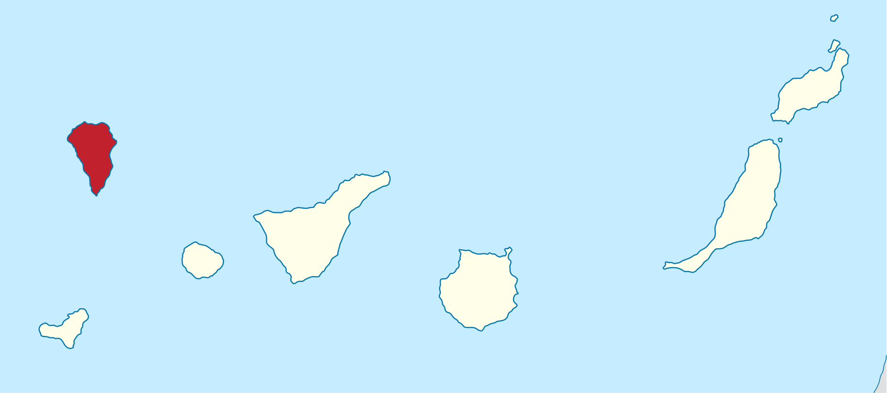

## Introduction

```{r}
eruptions <- c(1492, 1585, 1646, 1677, 1712, 1949, 1971, 2021)
n_eruptions <- length(eruptions)
```

```{r}
#| label: fig-timeline
#| fig-cap: Timeline of recent earthquakes on La Palma
#| fig-alt: An event plot of the years of the last 8 eruptions on La Palma.
#| fig-height: 1.5
#| fig-width: 6
par(mar = c(3, 1, 1, 1) + 0.1)
plot(eruptions, rep(0, n_eruptions), 
  pch = "|", axes = FALSE)
axis(1)
box()
```

```{r}
#| output: false
avg_years_between_eruptions <- mean(diff(eruptions[-n_eruptions]))
avg_years_between_eruptions
```

Based on data up to and including 1971, eruptions on La Palma happen every `{r} round(avg_years_between_eruptions, 1)` years on average.

Studies of the magma systems feeding the volcano, such as @marrero2019, have proposed that there are two main magma reservoirs feeding the Cumbre Vieja volcano; one in the mantle (30-40km depth) which charges and in turn feeds a shallower crustal reservoir (10-20km depth).

Eight eruptions have been recorded since the late 1400s (@fig-timeline).

Data and methods are discussed in @sec-data-methods.

Let $x$ denote the number of eruptions in a year. Then, $x$ can be modeled by a Poisson distribution

$$
p(x) = \frac{e^{-\lambda} \lambda^{x}}{x !}
$$ {#eq-poisson}

where $\lambda$ is the rate of eruptions per year. Using @eq-poisson, the probability of an eruption in the next $t$ years can be calculated.

| Name                 | Year   |
| -------------------- | ------ |
| Current              | 2021   |
| Teneguía             | 1971   |
| Nambroque            | 1949   |
| El Charco            | 1712   |
| Volcán San Antonio   | 1677   |
| Volcán San Martin    | 1646   |
| Tajuya near El Paso  | 1585   |
| Montaña Quemada      | 1492   |

: Recent historic eruptions on La Palma {#tbl-history}

@tbl-history summarises the eruptions recorded since the colonization of the islands by Europeans in the late 1400s.

{#fig-map}

La Palma is one of the west most islands in the Volcanic Archipelago of the Canary Islands (@fig-map). 



@fig-spatial-plot shows the location of recent Earthquakes on La Palma.

## Data & Methods {#sec-data-methods}

## Conclusion

## Adding our own things

Hi **Sietse** 👋😀. This is our manuscript file, where we bring our results together. They don't have to be generated here. Using the `embed` method from above, I bring in @fig-grand_overview that was created in the document `notebooks/desc_analysis.qmd`:



The nice thing is: @fig-grand_overview does not even exist in this manuscript, it is merely referenced. That means it will always be the latest version and can not be forgotten to update. 

The maybe equally nice thing is: once it is rendered/created in the original document, it will only be re-rendered, if the document changes (or you manually re-run it). That cuts down on computation time for iterative changes of the manuscript.

And that goes for our respective documents in general - once I render a quarto notebook, it stays rendered until I make changes. Same goes for your notebooks. That means we don't have to recreate each others computational environment - it is sufficient that we each are able to execute our notebooks to contribute to the main manuscript. 

## Embedding Test - Contextual Analysis
Test to embed a figure that was created in the "contex_analysis.qmd" notebook. This is just an exploratory figure.



## References {.unnumbered}

:::{#refs}

:::